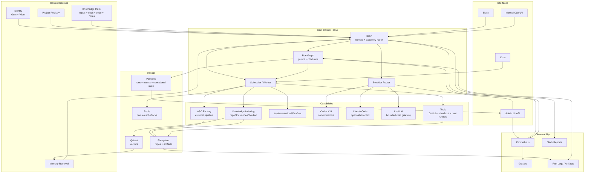
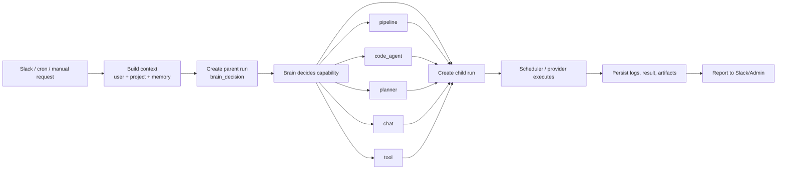
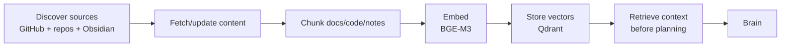

# Gem OS Blueprint

Gem OS is the orchestration layer. It receives requests, understands context,
chooses the right capability, creates a run graph, executes work through
pipelines/agents/tools, and reports the result.

## System Map

## Decision Flow

## Knowledge Flow

## Main Rules

- Gem is not one LLM. Gem chooses and controls capabilities.
- Every meaningful action starts as a run.
- Brain decisions are parent runs; selected capabilities are child runs.
- Codex is the default non-interactive planner/code-agent path.
- Claude Code headless is optional and disabled by default.
- LiteLLM is for bounded chat/model calls, not code-agent execution.
- Qdrant stores indexed knowledge; Postgres stores operational truth.

## Near-Term Build Order

1. Scheduler executes child runs.
2. Knowledge indexing pipelines.
3. Brain retrieval from Qdrant.
4. Slack bot connected to Brain.
5. ASO Factory execution through scheduler.
6. Codex host-runner adapter.
