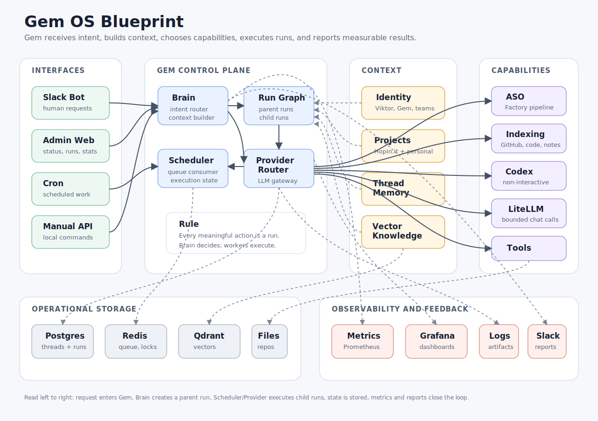
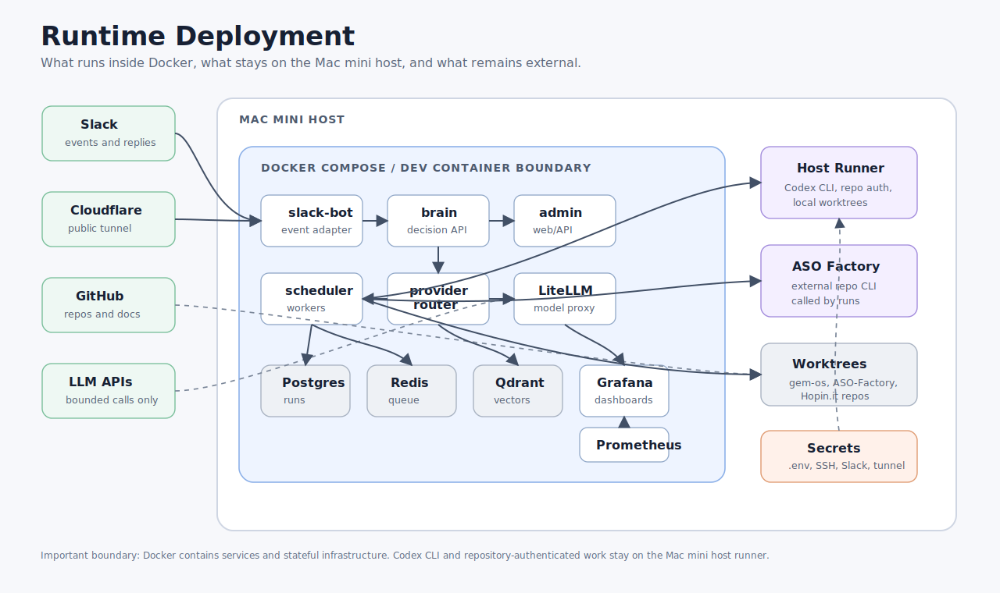
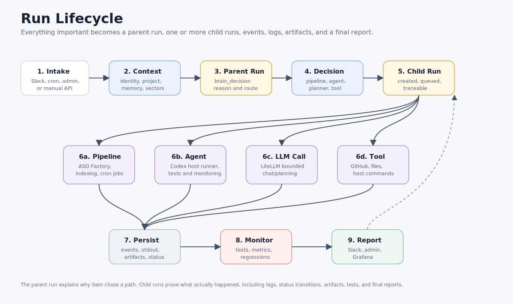

# Gem OS Blueprint

Gem OS is the orchestration layer. It receives intent, builds context, chooses
the right capability, creates a run graph, executes work through pipelines,
agents, and tools, then reports the result.

## 1. System Map

This is the mental model: interfaces enter on the left, Gem makes decisions in
the middle, capabilities execute on the right, and storage/observability close
the loop.

## 2. Runtime Deployment

This is the deployment model for the Mac mini:

- Docker Compose contains the long-running services and stateful infrastructure.
- `cloudflared` exposes the Slack/admin entry point when enabled.
- Codex CLI and authenticated repository work stay on the host runner.
- Secrets stay outside source control in `.env`, SSH config, Slack credentials,
  and tunnel credentials.

## 3. Run Lifecycle

This is the operational model:

- Brain creates a parent run that records the decision.
- Scheduler or provider adapters create child runs for actual execution.
- Every child run persists events, logs, status, and artifacts.
- Admin, Slack, Prometheus, and Grafana report what happened.

## How To Read It

Read the diagrams left to right:

1. A request enters through Slack, cron, admin, or manual API.
2. Brain builds context from identity, projects, memory, and indexed knowledge.
3. Brain creates a parent run and chooses the capability.
4. Scheduler or Provider Router creates and executes child runs.
5. State, vectors, artifacts, and metrics are persisted.
6. Admin, Grafana, logs, and Slack reports expose what happened.

## Core Idea

Gem is not one LLM. Gem is the control plane that decides which capability to
use for the current job.

The LLM is only one part of the system:

- Codex CLI is the default non-interactive code/planning executor.
- LiteLLM is for bounded model calls, not expensive code-agent execution.
- ASO Factory is an external pipeline Gem can run and monitor.
- Knowledge indexing gives Gem project memory before it plans or executes.
- Postgres stores operational truth: runs, events, status, and results.
- Qdrant stores searchable knowledge: repos, docs, code, and notes.

## Execution Rule

Every meaningful action is represented as a run.

- Brain decisions are parent runs.
- Selected capabilities are child runs.
- Child runs can be pipelines, code-agent runs, planner runs, chat calls, or
  tool executions.
- Scheduler and provider adapters execute child runs and update the run store.

## Near-Term Build Order

1. Scheduler executes child runs.
2. ASO Factory runs through scheduler.
3. Knowledge indexing pipelines.
4. Brain retrieval from Qdrant.
5. Slack bot connected to Brain.
6. Codex host-runner adapter.
